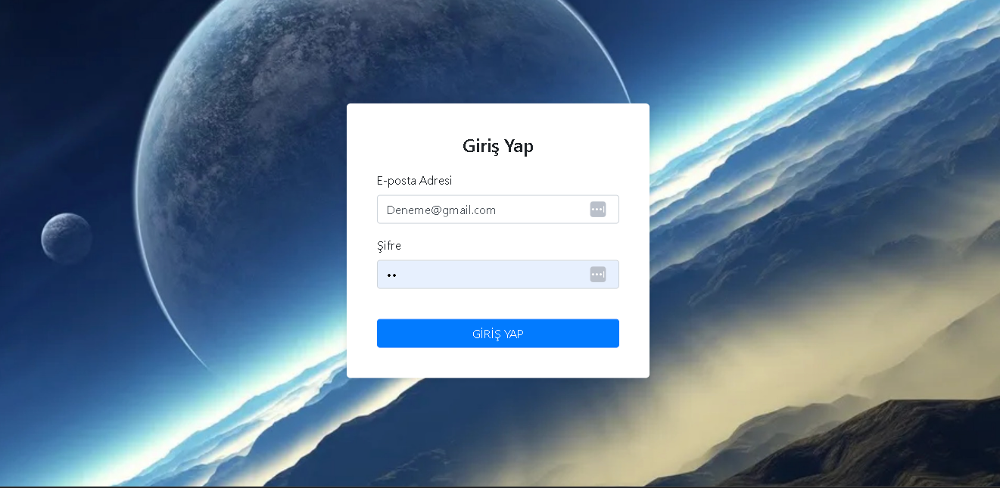
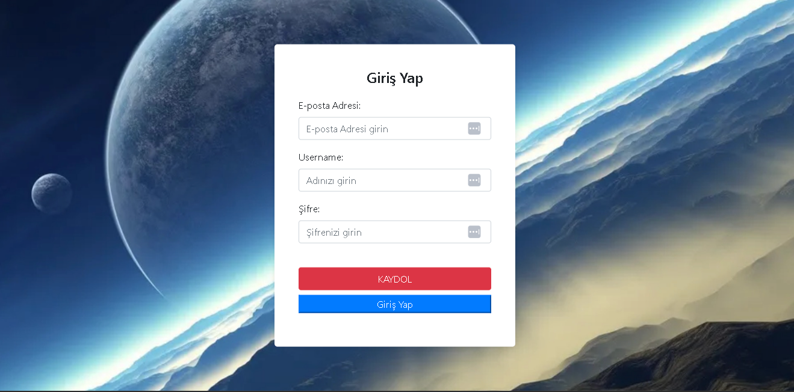

<h1 align="center">SQL-LOGIN PAGE</h1>

  

  

  Proje Açıklaması

## 🚀 Başlangıç

Bu proje ile SQL'e veri taşıyabilirsiniz.

### 🛠️ Gereksinimler

Aşağıdaki yazılımların yüklü olması gerekmektedir:

- Node.js ve npm
- MSSQL 
- sql 2017 kullanılabilir.

### 📥 Kurulum

1. Bu repository'i klonlayın veya indirin 
2. cd SQL-LOGIN-PAGE 
3. MSSQL kurulumunu yapalım ."system administrator(sa) şifresini 12 yapalım bu şifre işlemi services.bat dosyasının kurulum işlemini kolaylaştırır") 
4. sql kurulumundan sonra Nativ client ve Configuration Manager ayarları yapılmalıdır. 
5. services.bat üzerine sağ tıklayıp düzenle diyelim ve SERVER_NAME yazan verleri sql server name'nizle değiştirelim. 
6. services.bat dosyasını çalıştıralım.(Node.js veya Npm yüklü değilse hata alabilirsiniz bu normal bir durum) 
7. tarayıcı üzerinden indirilen node-v18.16.0-x64.msi dosyasını çalıştıralım ve node.js kurulumunu gerçekleştirelim. 
8. services.bat dosyasını yeniden çalıştıralım. 
9. start.bat ı çalıştıralım. 
10.http://localhost:8080/ tarayıcımızda açalım.

📝 Lisans
Bu proje MIT lisansı altında lisanslanmıştır. Daha fazla bilgi için LICENSE dosyasına bakabilirsiniz.

